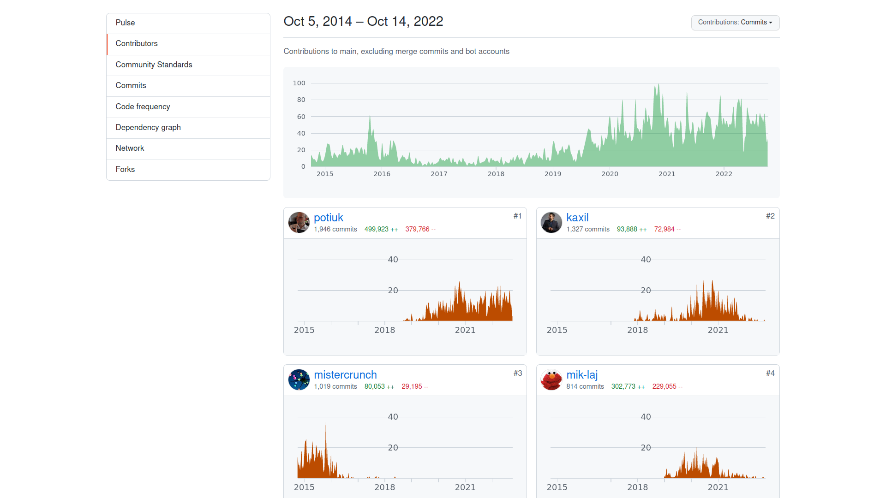
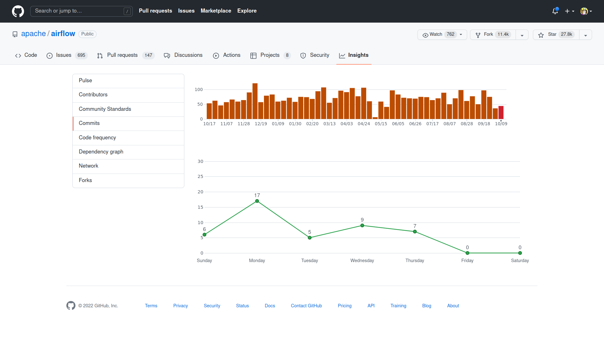
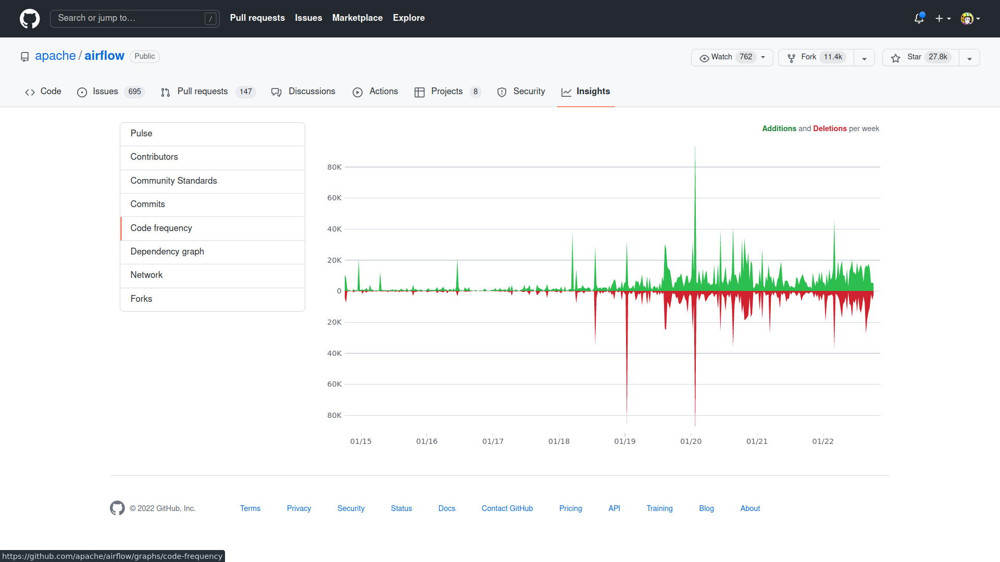
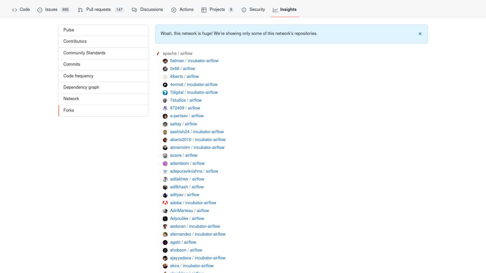

# Project Description


The goal of the project is to build an application called `GitInsight` that allows users to get insights over development in Git/GitHub repositories.

For example, on GitHub you get some of the following visualizations for your repositories when selecting the _Insights_ tab on top of a repository view: 

<table>
    <tr>
        <td><a href="https://github.com/apache/airflow/graphs/contributors"></a></td>
        <td><a href="https://github.com/apache/airflow/graphs/commit-activity"></a></td>
    </tr>
    <tr>
        <td><a href="https://github.com/apache/airflow/graphs/code-frequency"></a></td>
        <td><a href="https://github.com/apache/airflow/network/members"></a></td>
    </tr>
</table>

The project will be conducted in an agile and iterative fashion.
That is, from week to week you will extend your application and refactor it so that its design reflects the most current requirements.

## Week Zero (Week 42)

Find five other group members and register your group by sending a pull-request to the file [./PROJECT_GROUPS.md](./PROJECT_GROUPS.md) in which you add your group members to the respective column in the table.
Also, assign your group a name.
Remember, such a name has to be appropriate in a professional setting.

Please send in the message to the pull-request the IDs of your group members too so that TAs can more easily resolve merge conflicts.


## Week One (Week 43)

Build a small C#/.Net Core application that can be run from the command-line.
As a parameter, it should receive the path to a Git repository that resides in a local directory, i.e., a directory on your computer.

Given that path to a repository, your application should collect all commits with respective author names and author dates.
The data can be collected with the library [`libgit2sharp`](https://github.com/libgit2/libgit2sharp), which can be installed from [NuGet](https://www.nuget.org/packages/LibGit2Sharp).

Your program should be able to run in two modes, which may be indicated via command-line switches.

When running `GitInsight` in _commit frequency_ mode, it should produce textual output on stdout that lists the number of commits per day.
For example, the output might look like in the following:

```
      1 2017-12-08
      6 2017-12-26
     12 2018-01-01
     13 2018-01-02
     10 2018-01-14
      7 2018-01-17
      5 2018-01-18 
```

When running `GitInsight` in _commit author_ mode, it should produce textual output on stdout that lists the number of commits per day per author.
For example, the output might look like in the following:

```
Marie Beaumin
      1 2017-12-08
      6 2017-12-26
     12 2018-01-01
     13 2018-01-02
     10 2018-01-14
      7 2018-01-17
      5 2018-01-18 

Maxime Kauta
      5 2017-12-06
      3 2017-12-07
      1 2018-01-01
     10 2018-01-02
     21 2018-01-03
      1 2018-01-04
      5 2018-01-05 
```

Of course, as described by R. Martin, you try to keep your application as simple as possible to solve the task.
Remember that as good agile software engineers, you develop your project in a test-driven manner, i.e., start writing unit tests before implementing your solution.

Create one or more GitHub Action workflows that run your unit tests and that build your `GitInsight` application on every push to the main branch or on any pull-request that is merged into the main branch.

Next to the code, create a directory called `docs` in the root of your repository.
In it  use markdown documents to describe your project.
For the first week, provide a list of functional requirements that you extract from the description above.
When necessary, create describe interactions with your `GitInsight` application via use cases.

You have to develop your `GitInsight` application in a public GitHub repository (on github.com).
Before Friday 28/10 10:00, you have to send a pull-request to the file [./PROJECT_GROUPS.md](./PROJECT_GROUPS.md) in which you add the link to your repository.


## Week Two (Week 44)

Extend and if necessary refactor your `GitInsight` application so that results from analyzing Git repositories are stored in a database.
You choose which kind of database is most suitable for this task.
Earlier in this course you used an SQL Server database, so you might just want to reuse that.

You decide also how precisely you want to organize the data from Git repository analysis in your database, i.e., design the schema.
For sure, you have to store information about which repositories were analyzed at which state (the most recent commit).
In case a Git repository is re-analyzed, i.e., your database contains already results from a previous analysis, then the stored data has to be updated to the most current analysis results.
In case a Git repository is re-analyzed for which you already have analysis results that correspond to the most current state of the repository, then the analysis step should be skipped entirely and the output should be generated from the readily available data directly.

While designing and implementing your persistence solution, remember that you read and heard about certain patterns that might be good to apply in your implementation of a persistence feature.

Make sure that your test suite covers the newly introduced persistence feature in a reasonable way.


Update your project documentation in the `docs` directory to reflect the latest design and architecture of your application.
That is, illustrate the architecture of your tool with a suitable diagram.
Additionally, based the project description so far, generate a list of functional and non-functional requirements and store them in a respective text file.


## Week Three (Week 45)

Refactor your `GitInsight` application from last week from a command-line application into a web-application that exposes a REST API.
The REST API shall receive a repository identifier from GitHub, i.e., in the form `<github_user>/<repository_name>` or of the form `<github_organization>/<repository_name>`. 
In case the repository does not exist locally, then your `GitInsight` application shall clone the remote repository from GitHub and store it in a temporary local directory on your computer.
In case the repository was already cloned earlier, then the respective local repository shall be updated.
That is, using [`libgit2sharp`](https://github.com/libgit2/libgit2sharp) your application should update the local repository similar to running a `git pull` if you were to update a Git repository manually.
The analyses that your `GitInsight` application is performing on that now cloned local repository remain the same as described previously and they are stored in a database as required during last week.
The REST API shall return the analysis results via a JSON objects.

For example, in case your application is running on your computer (`localhost`) and it is listening to port 8000, then on a `GET` request to the route `http://localhost:8000/mono/xwt` will either clone or update the repository `mono/xwt` from GitHub into a temporary directory on your computer, run the analysis on that local repository, store in or update the database accordingly, and return the analysis results via a corresponding JSON object.


Update your test suite so that it covers the newly introduced persistence feature in a reasonable way.
Besides unit tests implement one or more integration tests in your test suite.
Likely it is also recommendable to add some API tests in a suitable format.

Illustrate the architecture of your REST service using a suitable notation.
Additionally, illustrate with an UML activity diagram the sequence of operations that your `GitInsight` application performs once triggered with a respective `GET` request and until it responds with the corresponding JSON data.


## Week Four (Week 46)

Add a front-end web-application that you write with .Net Blazor (WebAssembly) to your already existing applications.
That front-end application interacts with your `GitInsight` back-end application via the REST API that you implemented last week.

The front-end application should be able to receive the identifier of a GitHub repository (`<github_user>/<repository_name>` or `<github_organization>/<repository_name>` as described for last week, see above) via a suitable input field.

Next to that input field, implement visualizations to your .Net Blazor front-ends that look similar to those in the illustrations on top of this page.
These visualizations should present the results of the two analyses that you already implemented in your `GitInsight` applications, i.e., the commit frequencies over time and the and the commit frequencies over time per author.
You might want to use bar charts or another suitable chart type to present the analyses results.

Besides the [component providers that Rasmus mentioned in his lecture on web-applications](https://github.com/itu-bdsa/lecture-notes/blob/main/sessions/csharp_09/slides.md#component-vendors), you might want to check the following free and open-source tools to create charts with Blazor:

  * [Radzen](https://blazor.radzen.com/)
    - <https://blazor.radzen.com/chart-trends>
  * [Blazorize](https://blazorise.com/)
    - <https://bootstrapdemo.blazorise.com/tests/charts>
  * [ChartJs.Blazor](https://www.iheartblazor.com/)


Additionally, in your `GitInsight` back-end applications implement a new analysis.
It should be able to list all forks of a repository on GitHub.
To do so, it should call the [GitHub REST API](https://docs.github.com/en/rest) and [collect a list of all forks from a given repository](https://docs.github.com/en/rest/repos/forks#list-forks).
That is, when your `GitInsight` REST API receives a `GET` request with a GitHub repository identifier of the form `<github_user>/<repository_name>` or `<github_organization>/<repository_name>`, then besides the two already existing analyses of cloned Git repositories your application contacts the GitHub REST API to collect the number of forks of that repository.

To connect to the GitHub REST API, you need an _Access Token_.
Read [this documentation](https://docs.github.com/en/authentication/keeping-your-account-and-data-secure/creating-a-personal-access-token) on how to receive an Access Token for the GitHub REST API.
Remember and double check on how Rasmus demonstrated to handle secrets like access tokens in .Net projects.
That is, do not store the access token directly in your source code.
It should never end up in your source code repository that is publicly shared with the world.

Implement a visualization of the forks of a GitHub repository as a third visualization.
It might just be a list view similar as illustrated on top.
In case you find a more suitable visualization, you are free to choose that instead.

Now that your application changed, update the documentation of your `GitInsight` applications to reflect the current state of the application.
For sure, update the architecture illustration from last week.
Likely it is a good idea to illustrate how the front-end and the back-end interact when a new analysis is triggered via a sequence diagram.
In this case the it will be a sub-system sequence diagram where the blocks on top of swim lanes represent the front-end, back-end, and other systems as sub-systems instead of objects as shown multiple times in lectures, see for example [here](https://www.lucidchart.com/pages/uml-system-sequence-diagram).

Also make sure that your test suite actually tests your current application.
You likely want to add unit tests and integration tests for the new functionality.
If you like, add one or more end-to-end tests to your applications' test suite.


## Week Five (Week 47)

So far, your `GitInsight` applications can be assessed by anybody with access to the application's URL via a browser.
Also, the REST API of the back-end's can be accessed by anybody that knows the corresponding URL.
This week you extend you `GitInsight` applications with a feature that restricts access only to authorized users.
That is, based on the contents of Rasmus' lecture on security you modify your applications so that users have to authenticate themselves before they are able to analyze a GitHub repository.
This authentication should hold for the front-end web-application as well as for the back-and REST API. 

Additionally, make sure that all communication between your front-end application communicates and your back-end application (see last week's project description) is encrypted.

Besides these security related features, implement an analysis and visualization of your choice in your `GitInsight` applications.
For example, you might want to identify and present those files that change most often/least often, those files that change most often together (i.e., they appear in commits together, which is called logical coupling), identify groups of authors that work often on the same files, etc.

Make sure that the new features and analyses are covered by appropriate tests in your test suites.


**Optional features**:

If you have implemented an application with all the requirements presented so far and in case you are in the mood for a challenge work on the following:

Modify your `GitInsight` applications so that it can analyze _private_ repositories from GitHub.
That feature should work so that a user only specifies a private repository together with required information (security tokens, SSH keys, etc.) in the application's front-end.
Only analysis of private repositories to which a user has at least read access should be analyzable by a user.
